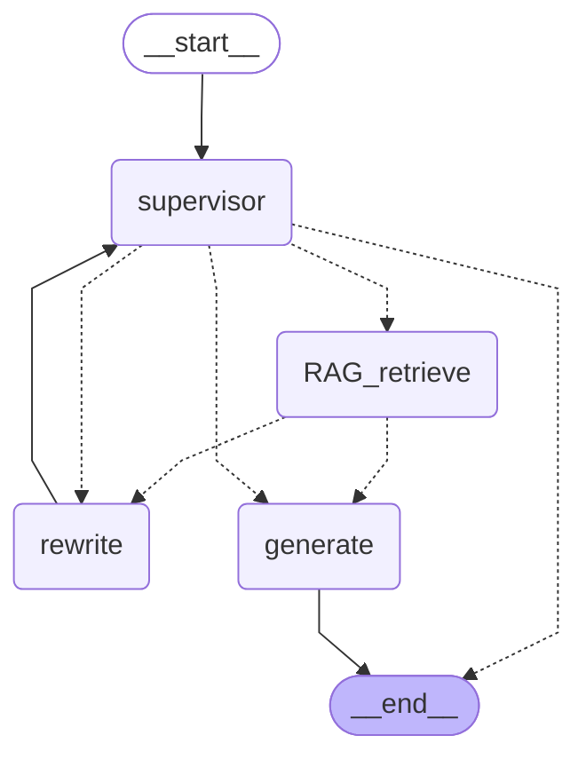

```mermaid
---
config:
  flowchart:
    curve: linear
---
graph TD;
	__start__([<p>__start__</p>]):::first
	supervisor(supervisor)
	RAG_retrieve(RAG_retrieve)
	rewrite(rewrite)
	generate(generate)
	__end__([<p>__end__</p>]):::last
	RAG_retrieve -.-> generate;
	RAG_retrieve -.-> rewrite;
	__start__ --> supervisor;
	rewrite --> supervisor;
	supervisor -.-> RAG_retrieve;
	supervisor -.-> __end__;
	supervisor -.-> generate;
	supervisor -.-> rewrite;
	generate --> __end__;
	classDef default fill:#f2f0ff,line-height:1.2
	classDef first fill-opacity:0
	classDef last fill:#bfb6fc
```